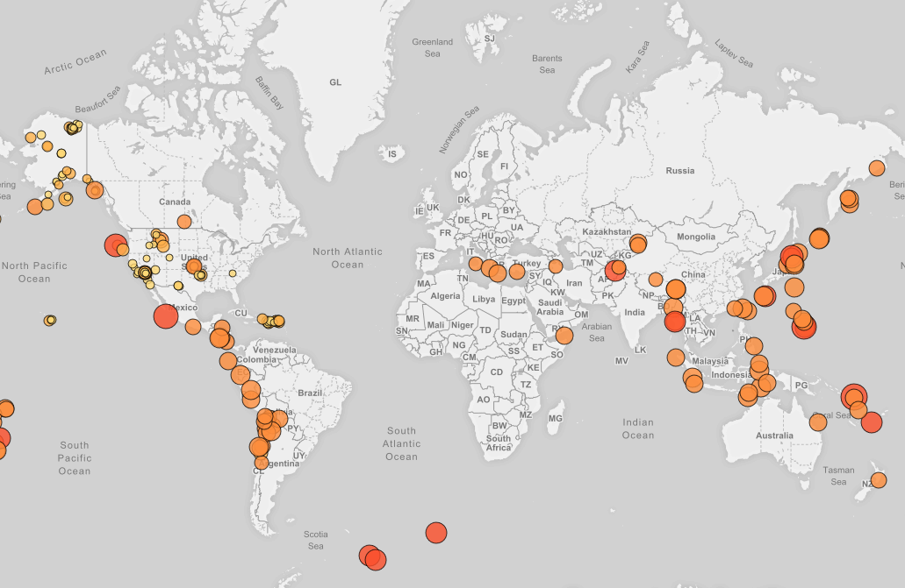

# Earthquake Activity Visualization
In this repository we use United States Geological Survey (USGS) data combined with leaflet API to produce a visualization seismic activity around the world.
Seismic data is obtained from USGS GeoJson page (https://earthquake.usgs.gov/earthquakes/feed/v1.0/geojson.php).

The visualization shows a map of all earthquakes of magnitude larger than 2.5 over the last seven days recorded by the USGS.
Please visit https://aalejandroq.github.io/Earthquake_Mapping_Leaflet/ to see visualization.

